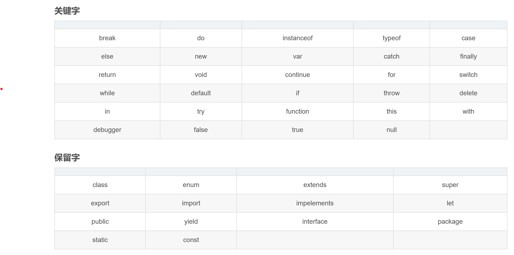

# 第10章 Javascript基础

## 1. Javascript组成
#### 1.ECMAScript——JavaScript的核心
ECMAScript是一套标准，定义了一种语言的标准，规定了基本语法、数据类型、关键字、具体API的设计规范等，解析引擎设计的参考标准，但与具体实现无关，是JavaScript的核心。
#### 2.BOM浏览器对象模型
BOM是一套操作浏览器功能的API，通过BOM可以操作浏览器窗口，比如：弹出框、控制浏览器跳转、获取分辨率等。
#### 3.DOM文档对象模型
DOM是一套操作页面元素的API，DOM可以把HTML看做是文档树，通过DOM提供的API可以对树上的节点进行操作。

## 2.关键字和保留字


## 3.变量
在JavaScript中，变量指的是一个可以改变的量。也就是说，变量的值在程序运行过程中是可以改变的。比如求和，本身没有“和”这个概念，我们需在重新中定义这个变量，并初始化“和”的值为0
#### 命名
在JavaScript中，给一个变量命名，我们需要遵循以下两个方面的原则。
- 变量由字母、下划线、$或数字组成，并且第一个字母必须是“字母、下划线或$”。
- 变量不能是系统关键字和保留字。
```js
let i
let lvye_study
let _lvye
let $str
let n123
```
#### 使用
```js
var 变量名 = 值;
console.log(变量名)//值
let 变量名;
console.log(变量名)//undefined
```

## 4.数据类型

### 1.数字Number
在JavaScript中，数字是最基本的数据类型。所谓的数字，就是我们数学上的数字，如10、-10、3.14等。
```html
<!DOCTYPE html> 
<html>
<head>
    <meta charset="utf-8" />
    <title></title>
    <script>
        let n = 1001;
        document.write(n);
    </script>
</head>
<body>
</body>
</html>
```
### 2.字符串String
字符串都是用英文单引号或英文双引号（注意都是英文）括起来的。
```html
<!DOCTYPE html> 
<html>
<head>
    <meta charset="utf-8" />
    <title></title>
    <script>
        let str1 = "绿叶，给你初恋般的感觉~";
        let str2 = '绿叶，给你初恋般的感觉~';
        document.write(str1);
        console.log(str2)
    </script>
</head>
<body>
</body>
</html>
```
### 3.布尔Boolean
在JavaScript中，数字和字符串这两个类型的值可以有无数多个，但是布尔类型的值只有2个：true和false。true表示“真”，false表示“假”。
```html
<!DOCTYPE html> 
<html>
<head>
    <meta charset="utf-8" />
    <title></title>
    <script>
        document.write(1>2);
        document.write(0<1);
    </script>
</head>
<body>
</body>
</html>
```
### 4.未定义值Undefined
在JavaScript中，未定义值，指的是如果一个变量虽然已经用let来声明了，但是并没有对这个变量进行赋值，此时该变量的值就是“未定义值”。其中，未定义值用undefined表示。
```html
<!DOCTYPE html> 
<html>
<head>
    <meta charset="utf-8" />
    <title></title>
    <script>
        
        let n;
        document.write(n);
    </script>
</head>
<body>
</body>
</html>
```
### 5.空值Null
数字、字符串等数据在定义的时候，系统都会分配一定的内存空间。在JavaScript中，空值用null表示。如果一个变量的值等于null，如“var n = null”，则表示系统没有给这个变量n分配内存空间。

### 6.复杂数据类型-数组
我们知道：一个变量可以存储一个值。我们可以用一个数组来保存多个值
```html
<!DOCTYPE html> 
<html>
<head>
    <meta charset="utf-8" />
    <title></title>
    <script>
      //不使用数组
      var str1 = "HTML";
      var str2 = "CSS";
      var str3 = "JavaScript";
      var str4 = "jQuery";
      var str5 = "Vue.js";
      //使用数组
      let arr = ["HTML", "CSS", "JavaScript", "jQuery", "Vue.js"];
      console.log(arr.length)//数组长度
      console.log(arr[0])//HTML第一个元素
      console.log(arr[1])//CSS第二个元素
      arr.push("React.js")//追加一个元素
      arr.pop()//删除最后一个元素
      arr.join()//把数组中的所有元素转换为一个字符串
      arr.reverse()//倒序排序
    </script>
</head>
<body>
</body>
</html>
```
## 其他

- document.write()：在页面输出一个内容。
- alert弹出一个对话框。
- console.log()控制台输出信息


## 作业
```html

<!DOCTYPE html>
<html>
	<head>
		<meta charset="utf-8" />
		<title></title>
	    <style>
	        body{
		        background-color: red;
	        }
	    </style>
	</head>
	<body>
		<script>
			//1.数字定义
			let num1 = 101
			let num2 = 98
			let num3 = 105
			let sum = num1 * num2+num3
			console.log(sum)
            //2.字符
			let name1 = 'my name is "zhengsan" '
			let name2 = 'my name is "李四" '
			let name3 = 'my name is "李红" '
      let numStr = 100 + '100' //等于多少
			console.log(name1)
			console.log(name2)
			console.log(name3)
			
			let scoreShort1 = "123"
			let scoreShort2 = "133"
			console.log(scoreShort1)
			console.log(scoreShort2)
			
			let short = "我的语文成绩是："+scoreShort1+",我的数学成绩是"+scoreShort2
			let template = `我的语文成绩是:${scoreShort1},我的数学成绩是:${scoreShort2}`
			console.log(short)
			console.log(template)
			
			//字符长度和位置
			console.log("字符长度是："+template.length+"; 第一个字符是"+template.charAt(0))
			
			//截取
			let score1 = template.slice(8,11)
			let score2 = template.substring(20.23)
			console.log("截取的结果1是"+score1)
			console.log("截取的结果2是"+score2)
			console.log("截取的结果3是"+template.substr(8,3))
			
			//查找
			console.log(template.indexOf("1"))
			console.log(template.lastIndexOf("1"))
			
			//字符数字的区别
			let number1 = 1
			let number2 = '2'
			console.log(number1+number2)
			
			//布尔
			let isnum = true
			let isnum2 = "true"
			console.log(isnum, typeof isnum)
			console.log(isnum2, typeof isnum2)
			
			//转换
			let numString= "123 奥术大师多"
			console.log(numString, typeof numString)
			console.log(parseInt(numString), typeof parseInt(numString))
			
			const one = 1
			console.log(one,one+"",one.toString())
			
			//数组
			let arr = []
			let arr1 = [1,2,3,4]
			let arr2 = new Array()
			let arr3 = new Array("张三","李四")
			console.log("数组: ",arr)
            console.log("数组1: ",arr1)
            console.log("数组2: ",arr2)
            console.log("数组3: ",arr3)

            //增加数组
            arr1.push(5)
            console.log("数组1：",arr1)
            //删除最后一个元素
            arr1.pop()
            console.log("数组1：",arr1)
            //倒叙
            console.log("倒叙",arr1.reverse(),arr1.length)
            console.log("数组转字符串",arr1.join(','))


		</script>
	</body>
</html>
```