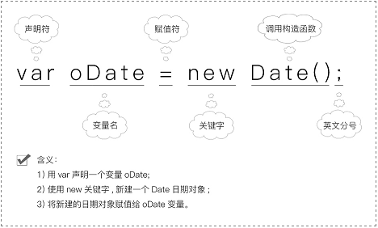

# 第 12 章 JavaScript 中对象

## 对象

万物皆对象，对象是一个具体的事物，看得见摸得着的实物。例如：一本书、一个人可以是对象，一个数据库、一个远程服务器的连接也可以是对象,所以 **“对象”是单个实物的抽象。**

JavaScript 中的对象是一个包含属性和方法的唯一实体。大多数时候，变量或数组不足以模拟现实生活中的情况，而为了应对这种情况，JavaScript 允许您创建对象。

对象是由属性和方法组件的：

- 属性：事物的特征，在对象中用属性来表示(常用名词)
- 方法：事物的行为，在对象中用方法来表示(常用动词)

## 类

前面说过，“对象”是单个实物的抽象。所以，通常需要一个模板，表示某一类实物的共同特征，然后“对象”根据这个模板生成。所以 **“类”就是对象的模板，对象就是“类”的实例，**，可以想象一个月饼模具和月饼

### 类的声明与定义

前面讲了，“类”就是对象的模板，类可以看作是数据或信息结构的模板。当我们需要描述某个结构化的数据或信息时，通常要描述以下 3 个相关的东西：

- 这种信息叫什么名称？
- 包含哪些属性？
- 包含哪些行为？

例如，我们要描述一个汽车对象，例如它有品牌和颜色等属性。此外可以定义它的行为，例如“移动”。那么使用 ES6 的语法定义如下类。

```html
<!DOCTYPE html>
<html>
  <head>
    <meta charset="utf-8" />
    <title></title>
    <script>
      class Car {
        constructor(brand, color) {
          this.brand = brand;
          this.color = color;
        }
        move() {
          console.log("the car is moving.");
        }
      }
    </script>
  </head>
  <body></body>
</html>
```

- class 是一个关键字，用来声明一个类。
- class 后面跟着这个类的名字，这里就是 Car。
- 接下来在大括号中定义了一个看起来像是函数的结构，它的名字是 constructor，称为“构造函数”。constructor 这个名字不能改，每个类都需要一个构造函数。如果一个类没有定义构造函数，- JavaScript 引擎也会自动创建一个默认的构造函数。构造函数定义了两个参数，分别是品牌和颜色，在创建对象的时候可以使用不同的参数。
- 在构造函数内部，定义了两个属性，分别是它的品牌 brand 和颜色 color。注意它们前面都有个“this.”，这个 this 是一个关键字，它代表将来由这个类创建出的“对象”。因此 this.brand 和 this.color 正是一个对象的两个属性，它们分别接收构造函数传入的参数。
- 接下来定义了一个函数 move()。这里需要注意两点：（1）constructor 和其他方法都不要加 function 关键字，（2）方法之间不要加分号或逗号。

::: tip
所谓“构造函数”，就是专门用来生成“对象”的函数
:::

### 通过类创建对象

当一个类定义好之后，可以使用 new 运算符创建对象，一个类可以产生任意多个对象（实例）

```html
<!DOCTYPE html>
<html>
  <body>
    <title>ES6的Class和对象</title>
    <script>
      class Car {
        constructor(brand, color) {
          this.brand = brand;
          this.color = color;
        }
        move() {
          console.log("the car is moving.");
        }
      }
      let car1 = new Car("BMW", "white");
      console.log(car1.brand);
      console.log(car1.color);
      car1.move();
      let car2 = new Car("TESLA", "black");
      console.log(car2.brand);
      console.log(car2.color);
    </script>
  </body>
</html>
```

### 对象初始化器创建对象

```html
<!DOCTYPE html>
<html>
  <body>
    <title>对象初始化器</title>
    <script>
      let car = {
        brand: "BMW",
        color: "white",
        move: function () {
          console.log("the car is moving.");
        },
      };
      console.log(car.brand);
      console.log(car.color);
      car.move();
    </script>
  </body>
</html>
```

### 对象比较

在 JavaScript 中，所有类型分为两种：**基本类型**和**对象类型**。基本类型，例如一个数字的类型，是“值类型”，而对象是“引用类型”。

如果某个变量是“值类型”，那么就这个值就直接在内存的“栈”中分配空间，而如果是一个变量的类型是对象，那么这个变量本身同样在栈中，但是它存储的仅仅是一个地址，这个地址指向的是一块在“堆”中的内存空间，真正的对象就存在这个空间里，也可以把这个对象的地址称为它的“引用”，从而把对象称为“引用类型”。

这也是正是初始化器和 new 操作符的作用，当声明了一个变量的时候，仅仅在栈上分配了一个空间，只有当初始化操作完成，或者使用 new 操作符调用了一个构造函数真正创建了对象以后，这个变量才真正可以被访问。

因此，即使两个对象具有完全相同的属性和相同的属性值，这两个对象也永远不会相等。这是因为它们指向不同的内存地址。而如果两个变量指向（或者叫做引用）同一个对象，那么这两个变量则是相同的。

```html
<!DOCTYPE html>
<html>
  <head>
    <title>比较两个对象</title>
  </head>

  <body>
    <script>
      let obj1 = { name: "Tom" };
      let obj2 = { name: "Tom" };
      let obj3 = obj1;
      console.log(obj1 == obj2); // return false
      console.log(obj1 === obj2); // return false
      console.log(obj1 == obj3); // return true
      console.log(obj1 === obj3); // return true
    </script>
  </body>
</html>
```

## 内置对象

### 日期 Date 对象

#### 语法

```js
var 日期对象名 = new Date();
```



创建一个日期对象，必须使用 new 关键字。其中 Date 对象的方法有很多，主要分为两大类：getXxx()和 setXxx()。getXxx()用于获取时间，setXxx()用于设置时间。

#### 用于获取时间的 getXxx()

| 方法          | 说明                                                           |
| ------------- | -------------------------------------------------------------- |
| getFullYear() | 获取年份，取值为 4 位数字                                      |
| getMonth()    | 获取月份，取值为 0（一月）到 11（十二月）之间的整数            |
| getDate()     | 获取日数，取值为 1~31 之间的整数                               |
| getDay()      | 获取星期几，从 0（星期日）到 6（星期六）                       |
| getHours()    | 获取小时数，取值为 0~23 之间的整数                             |
| getMinutes()  | 获取分钟数，取值为 0~59 之间的整数                             |
| getSeconds()  | 获取秒数，取值为 0~59 之间的整数                               |
| getTime()     | 获取从 GMT 时间 1970 年 1 月 1 日 0 点 0 分 0 秒起经过的毫秒数 |

```html
<!DOCTYPE html>
<html>
  <head>
    <title>获取当前的年月日</title>
    <script>
      let oMyDate = new Date();
      let iYear = oMyDate.getFullYear();
      let iMonth = oMyDate.getMonth() + 1; //月份是从0开始的
      let iDate = oMyDate.getDate();
      let iDay = oMyDate.getDay();
      switch (iDay) {
        case 0:
          iDay = "星期日";
          break;
        case 1:
          iDay = "星期一";
          break;
        case 2:
          iDay = "星期二";
          break;
        case 3:
          iDay = "星期三";
          break;
        case 4:
          iDay = "星期四";
          break;
        case 5:
          iDay = "星期五";
          break;
        case 6:
          iDay = "星期六";
          break;
        default:
          iDay = "error";
      }
      console.log(
        "今天是" + iYear + "年" + iMonth + "月" + iDate + "日," + iDay
      );
    </script>
  </head>
  <body></body>
</html>
```

#### 用于设置时间的 setXxx()

| 方法          | 说明                     |
| ------------- | ------------------------ |
| setFullYear() | 可以设置年、月、日       |
| setMonth()    | 可以设置月、日           |
| setDate()     | 可以设置日               |
| setHours()    | 可以设置时、分、秒、毫秒 |
| setMinutes()  | 可以设置分、秒、毫秒     |
| setSeconds()  | 可以设置秒、毫秒         |

```html
<!DOCTYPE html>
<html>
  <head>
    <meta charset="utf-8" />
    <title></title>
    <script>
      var d = new Date();
      d.setFullYear(1992, 09, 01);
      document.write("我设置的时间是：<br/>" + d);
    </script>
  </head>
  <body></body>
</html>
```

```html
<!DOCTYPE html>
<html>
  <head>
    <title>计算倒计时</title>
    <script>
      function disDate(oDate, iDate) {
        let ms = oDate.getTime(); //换成毫秒数
        ms -= iDate * 24 * 60 * 60 * 1000; //计算相差的毫秒数
        return new Date(ms); //返回新的时间对象
      }
      let oBeijing = new Date(2021, 0, 1);
      let iNum = 100; //前100天
      let oMyDate = disDate(oBeijing, iNum);
      console.log(
        oMyDate.getFullYear() +
          "年" +
          (oMyDate.getMonth() + 1) +
          "月" +
          oMyDate.getDate() +
          "日" +
          "距离" +
          oBeijing.getFullYear() +
          "年" +
          (oBeijing.getMonth() + 1) +
          "月" +
          oBeijing.getDate() +
          "日为" +
          iNum +
          "天"
      );
    </script>
  </head>
  <body></body>
</html>
```

:::tip
你不需要把所有的东西都记住，记住常用的就可以走得很远。识其实可以分为两种：一种是“记忆性知识”；另外一种叫“可翻阅知识”。
:::

### 数学计算：Math 对象

#### 语法

```
Math.属性
Math.方法
```

#### Math 对象的属性

| 属性    | 说明                  | 对应的数学形式 |
| ------- | --------------------- | -------------- |
| PI      | 圆周率                | π              |
| LN2     | 2 的自然对数          | ln(2)          |
| LN10    | 10 的自然对数         | ln(10)         |
| LOG2E   | 以 2 为底的 e 的对数  | log2e          |
| LOG10E  | 以 10 为底的 e 的对数 | log10e         |
| SQRT2   | 2 的平方根            | √2             |
| SQRT1_2 | 2 的平方根的倒数      | 1/√2           |

```html
<!DOCTYPE html>
<html>
  <head>
    <meta charset="utf-8" />
    <title></title>
    <script>
      document.write("圆周率为：" + Math.PI);
    </script>
  </head>
  <body></body>
</html>
```

#### Math 对象中的方法（常用）

| 方法         | 说明                     |
| ------------ | ------------------------ |
| max(a,b,…,n) | 返回一组数中的最大值     |
| min(a,b,…,n) | 返回一组数中的最小值     |
| sin(x)       | 正弦                     |
| cos(x)       | 余弦                     |
| tan(x)       | 正切                     |
| asin(x)      | 反正弦                   |
| acos(x)      | 反余弦                   |
| atan(x)      | 反正切                   |
| atan2(y, x)  | 反正切（注意 y、x 顺序） |
| floor(x)     | 向下取整                 |
| ceil(x)      | 向上取整                 |
| random()     | 生成随机数               |
| round ()     | 四舍五入                 |

#### Math 对象中的方法（不常用）

| 方法     | 说明                        |
| -------- | --------------------------- |
| abs(x)   | 返回 x 的绝对值             |
| sqrt(x)  | 返回 x 的平方根             |
| log(x)   | 返回 x 的自然对数（底为 e） |
| pow(x,y) | 返回 x 的 y 次幂            |
| exp(x)   | 返回 e 的指数               |

```html
<!DOCTYPE html>
<html>
  <head>
    <meta charset="utf-8" />
    <title></title>
    <script>
      var a = Math.max(3, 9, 1, 12, 50, 21);
      var b = Math.min(3, 9, 1, 12, 50, 21);
      document.write("最大值为：" + a + "<br/>");
      document.write("最小值为：" + b);
    </script>
  </head>
  <body></body>
</html>
```

x 表示角度值，用弧度来表示，常用形式为度数\*Math.PI/180

```html
<!DOCTYPE html>
<html>
  <head>
    <meta charset="utf-8" />
    <title></title>
    <script>
      document.write("sin30°：" + Math.sin((30 * Math.PI) / 180) + "<br/>");
      document.write("cos60°：" + Math.cos((60 * Math.PI) / 180) + "<br/>");
      document.write("tan45°：" + Math.tan((45 * Math.PI) / 180));
    </script>
  </head>
  <body></body>
</html>
```

##### 随机数

（1）Math.random()*m
表示生成 0~m 之间的随机数，例如“Math.random()*10”表示生成 0-10 之间的随机数。

（2）Math.random()*m+n
表示生成 n~m+n 之间的随机数，例如“Math.random()*10+8”表示生成 8-18 之间的随机数。

（3）Math.random()*m-n
表示生成-n~m-n 之间的随机数，例如“Math.random()*10-8”表示生成-8-2 之间的随机数。

（4）Math.random()*m-m
表示生成-m~0 之间的随机数，例如“Math.random()*10-10”表示生成-10-0 之间的随机数。

##### 随机整数

对于 Math.random()*5 来说，由于 floor()是向下取整，因此 Math.floor(Math.random()*5)生成的是 0~4 之间的随机整数。如果你想生成 0~5 之间的随机整数，应该写成：

Math.floor(Math.random()\*(5+1))
也就是说，如果你想生成 0 到 m 之间的随机整数，应该这样写：

Math.floor(Math.random()\*(m+1))
如果你想生成 1 到 m 之间的随机整数（包括 1 和 m），应该这样写：

Math.floor(Math.random()\*m)+1
如果你想生成 n 到 m 之间的随机整数（包括 n 和 m），应该这样写：

Math.floor(Math.random()\*(m-n+1))+n

## 实操题 生成随机验证码

```html
<!DOCTYPE html>
<html>
  <head>
    <meta charset="utf-8" />
    <title></title>
    <script>
      var str =
        "abcdefghijklmnopqrstuvwxyzABCDEFGHIJKLMNOPQRSTUVWXYZ1234567890";
      var arr = str.split("");
      var result = "";
      for (var i = 0; i < 4; i++) {
        var n = Math.floor(Math.random() * arr.length);
        result += arr[n];
      }
      document.write(result);
    </script>
  </head>
  <body></body>
</html>
```
