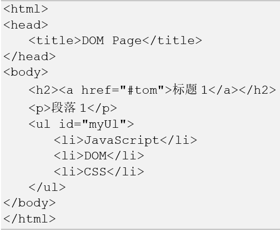
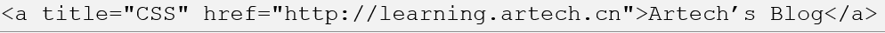
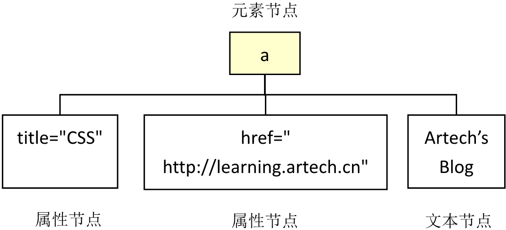

# 第 14 章 DOM

DOM (Document Object Model) 译为文档对象模型，是 HTML 和 XML 文档的编程接口。

- HTML DOM 定义了访问和操作 HTML 文档的标准方法。
- DOM 以树结构表达 HTML 文档。一段简单的 HTML 代码可以被分解为树状图




## DOM 节点

DOM 是网页的核心结构，无论是 HTML、CSS 还是 JavaScript 都和 DOM 密切相关。HTML 的作用是构建 DOM 结构，CSS 是设定样式，而 JavaScript 则用来读取 DOM 以及控制、修改 DOM。

我们在操作元素时，其实就是把这个元素看成一个对象，然后使用这个对象的属性和方法来进行相关操作

### A.DOM 模型中的节点

在 DOM 中有三种节点，分别是**元素节点**、**文本节点**和**属性节点**。

#### 1.元素节点

- 整个 DOM 模型都是由元素节点（element node）构成的。上图中显示的所有节点包括`<html>`、`<body>`、`<meta>`、`<h2>`、`<p>`、`<li>`等都是元素节点，各种标签便是这些元素节点的名称，例如文本段落元素的名称为“p”，无序清单的名称为“ul”等。
- 元素节点可以包含其他的元素，例如上例中所有的项目列表`<li>`都包含在`<ul>`中，唯一没有被包含的就只有根元素`<html>`。

#### 2.文本节点

- 页面的最终目的是向用户展示内容。例如上例在`<h2>`标记中有文本“标题 1”，项目列表`<li>`中有 JavaScript、DOM、CSS 等文本。这些具体的文本在 DOM 模型中称之为文本节点（text node）。
- 在 XHMTL 文档里，文本节点总是被包含在元素节点的内部，但并不是所有的元素节点都包含文本节点。例如`<ul>`节点里就没有直接包含任何文本节点，只是包含了一些元素节点`<li>`，`<li>`中才包含着文本节点

#### 3.属性节点

作为页面中的元素，或多或少会有一些属性，例如几乎所有的元素都有一个 title 属性。开发者可以利用这些属性来对包含在元素里的对象做出更准确的描述




### B.通过 JavaScript 访问 DOM

#### 1.访问节点

getElementsByTagName()用来返回包含某个相同标签名的元素 NodeList

```html
<!DOCTYPE html>
<html>
  <head>
    <title>getElementsByTagName()</title>
    <script>
      function searchDOM() {
        //放在函数内，页面加载完成后才用<body>的onload加载
        let oLi = document.getElementsByTagName("li");
        //输出长度、标签名称以及某项的文本节点值
        console.log(
          `${oLi.length} ${oLi[0].tagName} ${oLi[3].childNodes[0].nodeValue}`
        );
      }
    </script>
  </head>
  <body onload="searchDOM()">
    <ul>
      客户端语言
      <li>HTML</li>
      <li>JavaScript</li>
      <li>CSS</li>
    </ul>
    <ul>
      服务器端语言
      <li>JAVA</li>
      <li>PHP</li>
      <li>C#</li>
    </ul>
  </body>
</html>
```

```html
<!DOCTYPE html>
<html>
  <head>
    <title>getElementsById()</title>
    <script>
      function searchDOM() {
        let oLi = document.getElementById("cssLi");
        //输出标签名称以及文本节点值
        console.log(oLi.tagName + " " + oLi.childNodes[0].nodeValue);
      }
    </script>
  </head>
  <body onload="searchDOM()">
    <ul>
      客户端语言
      <li>HTML</li>
      <li>JavaScript</li>
      <li id="cssLi">CSS</li>
    </ul>
    <ul>
      服务器端语言
      <li>JAVA</li>
      <li>PHP</li>
      <li>C#</li>
    </ul>
  </body>
</html>
```

#### 2.检测节点类型

通过节点的 nodeName 获取节点类型名称，通过 nodeType 获取节点类型:

- 元素节点的 NodeType 为 1
- 属性节点的 NodeType 为 2
- 文本节点的 NodeType 为 3

```html
<!DOCTYPE html>
<html>
  <head>
    <title>获取DOM的节点类型</title>
    <script>
      function myDOMInspector() {
        let oUl = document.getElementById("myList"); //获取<ul>标记
        let DOMString = "";
        if (oUl.hasChildNodes()) {
          //判断是否有子节点
          for (let item of oUl.childNodes) //逐一查找
            DOMString +=
              "元素名字为：" +
              item.nodeName +
              "元素类型为" +
              item.nodeType +
              "\n";
        }
        console.log(DOMString);
      }
    </script>
  </head>
  <body onload="myDOMInspector()">
    <ul id="myList">
      <li>Java</li>
      <li>Node.js</li>
      <li>C#</li>
    </ul>
  </body>
</html>
```

#### 3.父子兄关系

##### 获取子节点

```html
<!DOCTYPE html>
<html>
  <head>
    <title>获取DOM的节点类型</title>
    <script>
      function myDOMInspector() {
        let oUl = document.getElementById("myList"); //获取<ul>标记
        let DOMString = "";
        if (oUl.hasChildNodes()) {
          //判断是否有子节点
          for (let item of oUl.childNodes) //逐一查找
            DOMString +=
              "元素名字为：" +
              item.nodeName +
              "元素类型为" +
              item.nodeType +
              "\n";
        }
        console.log(DOMString);
      }
    </script>
  </head>
  <body onload="myDOMInspector()">
    <ul id="myList">
      <li>Java</li>
      <li>Node.js</li>
      <li>C#</li>
    </ul>
  </body>
</html>
```

##### 获取父节点

```html
<!DOCTYPE html>
<html>
  <head>
    <title>获取父节点</title>
    <script>
      function myDOMInspector() {
        let myItem = document.getElementById("cssLi");
        console.log(myItem.parentNode.tagName); //访问父节点
      }
    </script>
  </head>
  <body onload="myDOMInspector()">
    <ul>
      <li>Java</li>
      <li id="cssLi">Node.js</li>
      <li>C#</li>
    </ul>
  </body>
</html>
```

```html
<!DOCTYPE html>
<html>
  <head>
    <title>递归获取父节点</title>
    <script>
      function myDOMInspector() {
        let myItem = document.getElementById("cssLi");
        let parentElm = myItem.parentNode;
        while (parentElm.className != "colorful" && parentElm != document.body)
          parentElm = parentElm.parentNode; //一路往上找
        console.log(parentElm.tagName);
      }
    </script>
  </head>
  <body onload="myDOMInspector()">
    <div class="colorful">
      <ul>
        <li>Java</li>
        <li id="cssLi">Node.js</li>
        <li>C#</li>
      </ul>
    </div>
  </body>
</html>
```

##### 获取兄弟节点

- nextSibling 下一个兄弟节点
- previousSibling 上一个兄弟节点

```html
<!DOCTYPE html>
<html>
  <head>
    <title>DOM的兄弟关系</title>
    <script>
      function myDOMInspector() {
        let myItem = document.getElementById("cssLi");
        //访问兄弟节点
        let nextListItem = myItem.nextSibling;
        let nextNextListItem = nextListItem.nextSibling;
        let preListItem = myItem.previousSibling;
        let prePreListItem = preListItem.previousSibling;
        console.log(
          prePreListItem.tagName +
            " " +
            preListItem.tagName +
            "  " +
            nextListItem.tagName +
            " " +
            nextNextListItem.tagName
        );
      }
    </script>
  </head>
  <body onload="myDOMInspector()">
    <ul>
      <li>Java</li>
      <li id="cssLi">Node.js</li>
      <li>C#</li>
    </ul>
  </body>
</html>
```

#### 4.节点的属性

##### 获取节点属性

```html
<!DOCTYPE html>
<html>
  <head>
    <title>getAttribute()</title>
    <script>
      function myDOMInspector() {
        //获取图片
        let myImg = document.getElementsByTagName("img")[0];
        //获取图片title属性
        console.log(myImg.getAttribute("src"));
      }
    </script>
  </head>
  <body onload="myDOMInspector()">
    
  </body>
</html>
```

##### 设置节点属性

```html
<!DOCTYPE html>
<html>
  <head>
    <title>setAttribute()</title>
    <script>
      function changePic() {
        //获取图片
        let myImg = document.getElementsByTagName("img")[0];
        //设置图片src和title属性
        myImg.setAttribute("src", "02.jpg");
        myImg.setAttribute("title", "一幅图片");
      }
    </script>
  </head>
  <body>
    
  </body>
</html>
```

#### 5.创建和操作节点

除了查找并处理节点属性外，DOM 提供了很多便捷的方法来管理节点，主要包括创建、删除、替换、插入

##### 创建并添加新节点

```html
<!DOCTYPE html>
<html>
  <head>
    <title>创建并添加新节点</title>
    <script>
      function createP() {
        let oP = document.createElement("p");
        let oText = document.createTextNode("这是一段感人的故事");
        oP.appendChild(oText);
        document.body.appendChild(oP);
      }
    </script>
  </head>
  <body onload="createP()">
    <p>事先写一行文字在这里，测试appendChild()方法的添加位置</p>
  </body>
</html>
```

##### 删除节点

```html
<!DOCTYPE html>
<html>
  <head>
    <title>删除节点</title>
    <script>
      function deleteP() {
        let oP = document.getElementsByTagName("p")[0];
        oP.parentNode.removeChild(oP); //删除节点
      }
    </script>
  </head>
  <body>
    <p onclick="deleteP()">点击一下，这行文字就看不到了</p>
  </body>
</html>
```

##### 替换节点

```html
<!DOCTYPE html>
<html>
  <head>
    <title>替换节点</title>
    <script>
      function replaceP() {
        let oOldP = document.getElementsByTagName("p")[0];
        let oNewP = document.createElement("p"); //新建节点
        let oText = document.createTextNode("这是一个真实的故事");
        oNewP.appendChild(oText);
        oOldP.parentNode.replaceChild(oNewP, oOldP); //替换节点
      }
    </script>
  </head>
  <body>
    <p onclick="replaceP()">点击一下这行文字就被被替换了</p>
  </body>
</html>
```

##### 插入新的节点

```html
<!DOCTYPE html>
<html>
  <head>
    <title>插入新的节点</title>
    <script>
      function insertP() {
        let oOldP = document.getElementsByTagName("p")[0];
        let oNewP = document.createElement("p"); //新建节点
        let oText = document.createTextNode("这是一个真实的故事");
        oNewP.appendChild(oText);
        oOldP.parentNode.insertBefore(oNewP, oOldP); //插入节点
      }
    </script>
  </head>
  <body>
    <p onclick="insertP()">点击一下，就会有文字插入到这行文字之前</p>
  </body>
</html>
```

通常页面一次性添加很多节点的时候，页面效率会很低，可以通过创建文档片段，先把节点创建到片段上，然后一次性增加到实际页面中

```html
<!DOCTYPE html>
<html>
  <head>
    <title>创建新节点的优化</title>
    <script>
      function insertColor() {
        let aColors = [
          "red",
          "green",
          "blue",
          "magenta",
          "yellow",
          "chocolate",
        ];
        let oFragment = document.createDocumentFragment(); //创建文档片段
        for (let item of aColors) {
          let oP = document.createElement("p");
          let oText = document.createTextNode(item);
          oP.appendChild(oText);
          oFragment.appendChild(oP); //将节点先添加到片段中
        }
        document.body.appendChild(oFragment); //最后一次性添加到页面
      }
    </script>
  </head>
  <body onload="insertColor()"></body>
</html>
```

### C.DOM 与 CSS

```html
<!DOCTYPE html>
<html>
  <head>
    <title>修改元素的CSS类-className</title>
    <style type="text/css">
      .dark {
        color: #666;
      }
      .light {
        color: #ccc;
      }
    </style>
    <script>
      function check() {
        let oMy = document.getElementsByTagName("ul")[0];
        oMy.className = "light"; //修改CSS类
      }
    </script>
  </head>
  <body>
    <ul onclick="check()" class="dark">
      <li>HTML</li>
      <li>JavaScript</li>
      <li>CSS</li>
    </ul>
  </body>
</html>
```

## 事件

事件是发生在 HTML 元素上的某些特定的事情，而他的目的是使页面具有某些行为，并执行特定的动作：

- 页面完成加载
- 按钮被点击
- 鼠标移到了某个元素上面

### 事件监听

#### 简单行内写法

```html
<p onclick="alert('我被点击了')">Click Me</p>
```

上面例子为定义一个 p 元素的“鼠标点击事件”，然后针对他编写事件处理程序，这就是事件

事件流：鼠标点击事件引发的不是一个事件，而是一系列事件：当 p 元素点击，他的父元素也被点击，父元素的父元素也被点击，组成了事件流

#### 设置事件监听函数

标准 DOM 定义了两个方法分别来添加和删除监听函数，即 addEventListener()和 removeEventListener()。

- “捕获阶段”：从最外层根元素`html`开始一次向下
- “到达阶段”：达到目标元素
- "冒泡阶段"：依次向上回到根元素

```html
<!DOCTYPE html>
<html>
  <head>
    <title>事件冒泡</title>
  </head>
  <body>
    <div>
      <p>这是一个段落</p>
      <p></p>
    </div>

    <script>
      document.querySelectorAll("*").forEach((element) =>
        element.addEventListener(
          "click",
          (event) => {
            console.log(
              event.target.tagName +
                " - " +
                event.currentTarget.tagName +
                " - " +
                event.eventPhase
            );
          },
          false //在冒泡阶段触发事件
          // true  //在捕获阶段触发事件
        )
      );
    </script>
    <p onclick="alert('我被点击了')">Click Me</p>
  </body>
</html>
```

### 事件对象

- 浏览器中的事件都是以对象的形式存在的，标准的 DOM 中规定事件对象必须作为唯一的参数传给事件处理函数，因此访问事件对象通常将其作为参数。
- 不同的事件对应的事件属性也不一样，例如鼠标移动相关的事件就会有坐标信息，而其他事件就不会包含坐标信息了。但是有一些属性和方法是所有事件都会包含的。

```html
<!DOCTYPE html>
<html>
  <head>
    <title>事件对象</title>
  </head>
  <body>
    <div id="target">
      <p>click p</p>
      click div
    </div>
    <script>
      document
        .querySelector("div#target")
        .addEventListener("click", (event) => {
          console.log(event.target.tagName);
        });
    </script>
  </body>
</html>
```

| 标准 DOM          | 类型     | 读/写                                | 说明                                           |
| ----------------- | -------- | ------------------------------------ | ---------------------------------------------- |
| altKey            | Boolean  | 读写                                 | 按下 ALT 键则为 true，否则为 false             |
| button            | Integer  | 读写                                 | 鼠标事件，值对应按下的鼠标键，详见 6.4.1 节    |
| cancelable        | Boolean  | 只读                                 | 是否可以取消事件的默认行为                     |
| stopPropagation() | Function | N/A 可以调用该方法来阻止事件向上冒泡 |
| clientX           | Integer  | 只读                                 | 鼠标在客户端区域的坐标，不包括工具栏、滚动条等 |
| clientY           |          |                                      |
| ctrlKey           | Boolean  | 只读                                 | 按下 Ctrl 键则为 true，否则为 false            |
| relatedTarget     | Element  | 只读                                 | 鼠标所离开的元素                               |
| relatedTarget     | Element  | 只读                                 | 鼠标正在进入的元素                             |
| charCode          | Integer  | 只读                                 | 按下按键的 Unicode 值                          |
| keyCode           | Integer  | 读写                                 | keypress 时为 0，其余为按下按键的数字代号。    |
| detail            | Integer  | 只读                                 | 鼠标按钮点击的次数                             |
| preventDefault()  |          | Function                             | N/A 可以调用该方法来阻止事件的默认行为         |
| screenX           | Integer  | 只读                                 | 鼠标相对于整个计算机屏幕的坐标值               |
| screenY           |          |                                      |                                                |
| shiftKey          | Boolean  | 只读                                 | 按下 Shift 键则为 true，否则为 false           |
| target            | Element  | 只读                                 | 引起事件的元素/对象                            |
| type              | String   | 只读                                 | 事件的名称                                     |

浏览器支持的事件种类是非常多了，可以分为几类，每类里面又有很多事件。事件可以分为一下类别：
用户界面事件：涉及与 BOM 交互的通用浏览器事件。
焦点事件：在元素获得或者失去焦点时触发的事件。
鼠标事件：使用鼠标在页面上执行某些操作时触发的事件。
滚轮事件：使用鼠标滚轮时触发的事件。
输入事件：向文档中输入文本时触发的事件。
键盘事件：使用键盘在页面上执行某些操作时触发的事件。
输入法事件：使用某些输入法是触发的时间。

## BOM

JavaScript 是运行在浏览器中的，同样也提供了一系列对象用于与浏览器窗口进行交互。
这些对象主要包括 window、document、location、navigator、screen 等，通常统称为 BOM（Brower Object Model）。

### window 对象

### navigator 对象

### screen 和 history 对象
