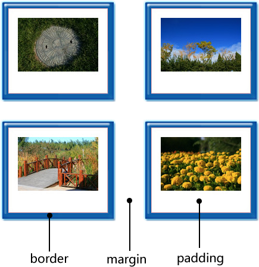
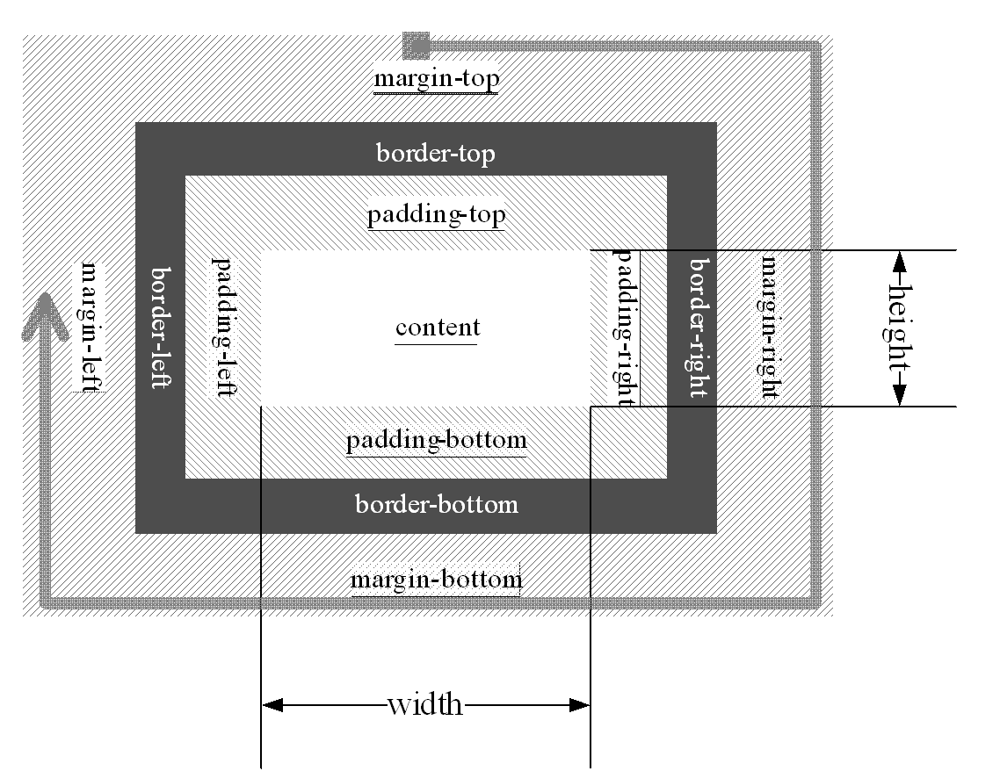
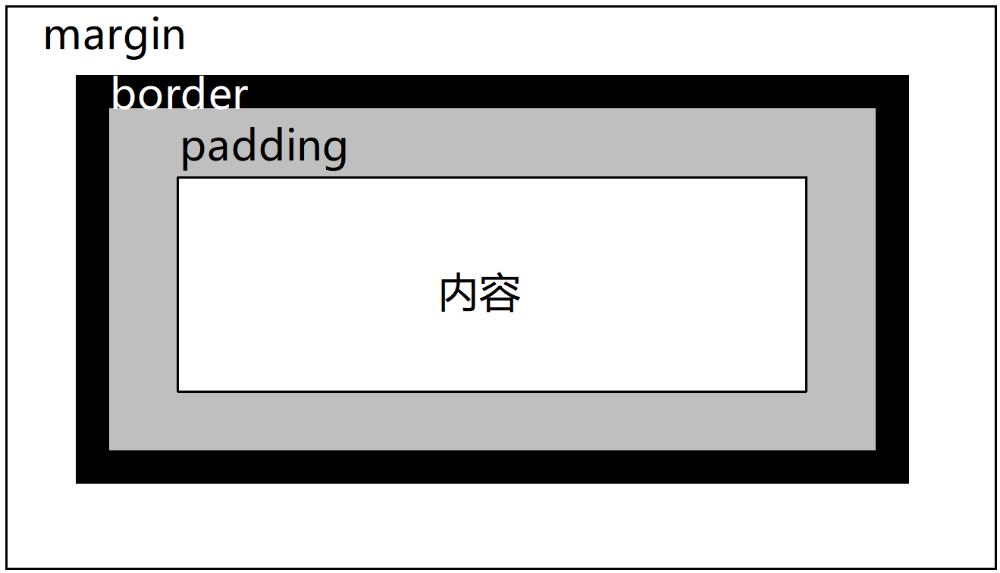

# 第 7 章 Javascript 基础

## 1.“盒子”与“模型”



- 对于每幅画来说，都有一个“边框”，在英文中称为“border”；
- 每个画框中，画和边框通常都会有一定的距离，这个距离称为“内边距”，在英文中称为“padding”；
- 各幅画之间通常也不会紧贴着，它们之间的距离称为“外边距”，在英文中称为“margin”。

## 2.盒子组成



- 在 CSS 中，一个独立的盒子模型由 content（内容）、border（边框）、padding（内边距）和 margin（外边距）4 个部分组成。
- 一个盒子实际所占有的宽度（或高度）是由“内容+内边距+边框+外边距”组成的
- 对于任何一个盒子，都可以分别设定 4 条边各自的 border、padding 和 margin

## 3.边框 border



::: tip
边框一般用于分隔不同元素，其外围即为元素的最外围，因此计算元素实际的宽和高时，就要将 border 纳入。換句话说，border 会占据空间，所以在计算精细的版面时，一定要把 border 的影响考虑进去。
:::

### 边框属性

- border-color 边框颜色
- border-width 边框粗细，单位 px
- border-style 边框样式：solid 实线、dotted 点画线、dashed 虚线

```html
<!DOCTYPE html>
<html>
  <head>
    <meta charset="utf-8" />
    <title></title>
    <style>
      .box {
        border-color: red;
        border-width: 1px;
        border-style: solid;
        /* 以上3句可简写为 */
        border: 1px solid red;
      }
    </style>
  </head>
  <body>
    <div class="box"></div>
  </body>
</html>
```

### 属性值简写

1. 一个属性值表示：上、右、下、左四条边框为同一个属性

```css
.box {
  border-color: red;
}
```

2. 两个属性值表示：上下边框为第一个属性（例子为 1px）、左右边框为第二个属性例子为（2px）

```css
.box {
  border-width: 1px 2px;
}
```

3. 三个属性值表示：上边框为第一个属性（例子为 1px）、左右边框为第二个属性例子为（2px）、下边框为第三个属性（3px）

```css
.box {
  border-width: 1px 2px 3px;
}
```

4. 三个属性值表示：上、右、下、左边框分别对应为： dotted、dashed、solid、double 注意顺序，顺时针，从上边框开始

```css
.box {
  border-style: dotted dashed solid double;
}
```

5. 单独设置某条边框和某条边框的属性

```css
.box {
  border-left：1px solid #eeeeee;
  border-left-color:red;
  border-left-style:dashed;
}
```

## 外边距 margin

margin 指的是元素与元素之间的距离,外边距分为 4 个方向：margin-top、margin-right、margin-bottom、margin-left。


### 语法

```css
margin: 像素值;
margin-top: 像素值;
margin-right: 像素值;
margin-bottom: 像素值;
margin-left: 像素值;
```

1. 一个属性值表示：上、右、下、左外边距为同一个属性

```css
.box {
  margin: 20px;
}
```

2. 两个属性值表示：上下外边距为第一个属性（例子为 1px）、左右外边距为第二个属性例子为（2px）

```css
.box {
  margin: 1px 2px;
}
```

3. 三个属性值表示：上外边距为第一个属性（例子为 1px）、左右外边距为第二个属性例子为（2px）、下外边距为第三个属性（3px）

```css
.box {
  marginh: 1px 2px 3px;
}
```

4. 三个属性值表示：上、右、下、左外边距分别对应为： 1px、2px、3px、4px 注意顺序，顺时针，从上外边距开始

```css
.box {
  margin: 1px 2px 3px 4px;
}
```

## 内边距 padding

内边距 padding，又常常被称为“补白”，它指的是内容区到边框之间的那一部分。内边距都是在边框内部的。


从 CSS 盒子模型中我们可以看出，内边距分为 4 个方向：padding-top、padding-right、padding-bottom、padding-left。

语法和外边距相同，参考外边距

## 标准文档流

将一个页面从上到下分为一行一行，其中块元素独占一行，相邻行内元素在每一行中按照从左到右排列直到该行排满。

### 块级元素（block level）

块级元素占据一行，并且跟同级的兄弟块依次竖直排列，左右撑满。

### 行内元素（inline）

行内元素之间横向排列，到最右端自动折行
